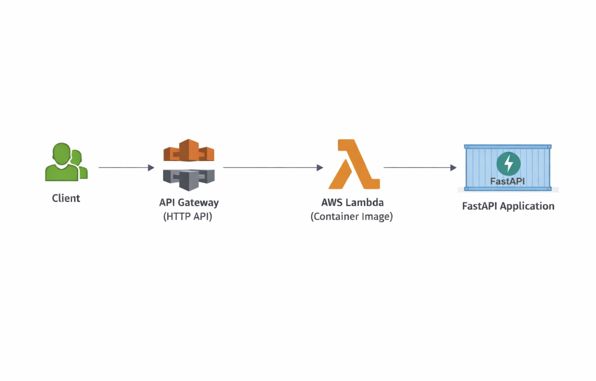

# Serverless Enrichment API

This project is a hands-on AWS serverless API built to better understand how containerized workloads actually run in a production-style cloud environment.

The service is a small FastAPI application that enriches basic user data and is deployed as a Docker container to AWS Lambda behind API Gateway. All infrastructure is managed with Terraform.

The goal wasn’t to overbuild — it was to build something realistic, deploy it properly, and understand where things break when you wire everything together.

---

## What This Does

The API exposes a few simple endpoints:

* `GET /health`
  Basic health check

* `POST /enrich-user`
  Accepts a JSON payload and returns normalized / enriched user data

* `GET /version`
  Returns deployment metadata (app version, git SHA, deploy timestamp)

This mirrors patterns you’d see in internal services or lightweight microservices.

---

## Tech Stack

* **Python** – FastAPI
* **Docker** – Containerized application
* **AWS Lambda** – Runs the container image
* **Amazon ECR** – Container registry
* **API Gateway (HTTP API)** – Public API entry point with proxy routing
* **Terraform** – Infrastructure as Code (IAM, Lambda, API Gateway)

---

## Architecture (High Level)

Client
→ API Gateway (HTTP API, proxy integration)
→ AWS Lambda (container image)
→ FastAPI application

All routing is handled by FastAPI via a catch-all proxy route.




---

## Why This Project

I wanted to go beyond console-clicking and actually understand:

* How Lambda container images differ from zip-based Lambdas
* Why region alignment across AWS services matters
* How Terraform behaves when managing existing resources
* What “owning your infrastructure” actually looks like end-to-end

I configured everything manually first to validate behavior, then migrated the setup into Terraform. One lesson learned there: make sure to remove manually created resources before deploying the IaC version, otherwise Terraform will (rightfully) complain that they already exist.

---

## Live Endpoints (Terraform Deployment)

> Deployed in **us-west-1**

* Health
  `GET https://rmmqc98co1.execute-api.us-west-1.amazonaws.com/health`

* Version
  `GET https://rmmqc98co1.execute-api.us-west-1.amazonaws.com/version`

* Enrich User

```bash
curl -X POST https://rmmqc98co1.execute-api.us-west-1.amazonaws.com/enrich-user \
  -H "Content-Type: application/json" \
  -d '{"first_name":"Conner","last_name":"Lorenz","email":"test@example.com"}'
```

---

## Infrastructure as Code

Terraform manages:

* IAM execution role for Lambda
* Lambda function (container image)
* API Gateway HTTP API
* Proxy routing (`ANY /{proxy+}`)
* Environment variables for versioning

Local Terraform state and provider files are intentionally ignored from source control.

---

## Notes / Lessons Learned

* Region alignment between ECR, Lambda, and API Gateway is not optional
* Lambda container deployments take longer than zip-based deployments
* Terraform state hygiene matters early, not later
* Adding version + git SHA visibility makes debugging much easier

---

## Next Improvements (Optional)

* Authentication (JWT or IAM)
* CI/CD pipeline for image build + Terraform apply
* Remote Terraform state (S3 + DynamoDB)
* Request logging / tracing


